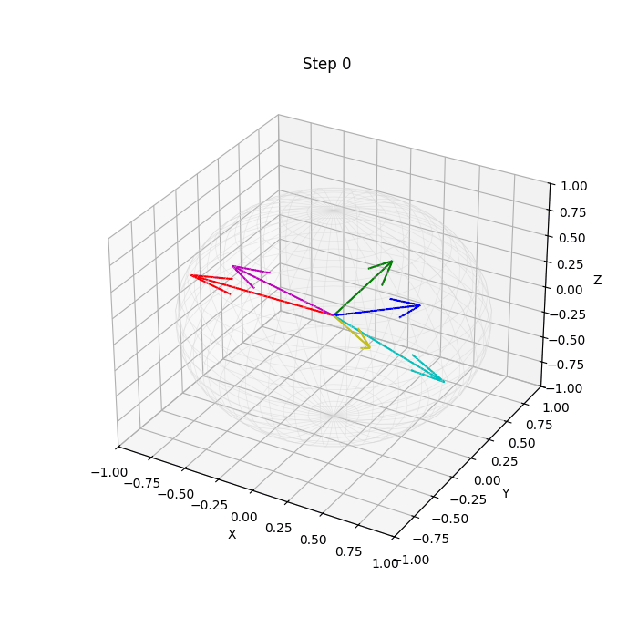

# Q-bitcoin 🪙  
### Predicting Interest Rates with Quantum Machine Learning (QML)

---

## 🧠 Overview

This project explores the application of **Quantum Machine Learning (QML)** to the **imputation and short-term forecasting** of **interest rate swap options (swaptions)**.  
We use a **synthetic swaption dataset** provided by **IBM**, which represents a realistic grid of **tenors × maturities** over time.  

The objectives are:
1. **Estimate missing values** within the swaption surface.  
2. **Forecast prices** for the following two weeks.  

By leveraging the ability of quantum circuits to **represent and process high-dimensional feature spaces**,  
we implement and compare several QML paradigms — including **Quantum Reservoir Computing (QRC)**, **Variational Quantum Circuits (VQC)**, and **Quantum Kernel Methods (QKM)**.  

This work is part of the **UTokyo Quantum Finance Frontier (QFF) 2025 Challenge**.

---

## 📈 Dataset

The dataset simulates a realistic **swaption price surface**, where each point corresponds to a specific **tenor (contract duration)** and **maturity (time to option expiry)**.  
Missing entries appear due to market data sparsity, and forecasting requires temporal extrapolation across this grid.

  

Swaptions are **options on interest rate swaps** — they give the right, but not the obligation,  
to enter an interest rate swap at a future date.  
Each data point reflects the **premium price** determined by forward-looking market volatility, liquidity, and macroeconomic factors.

  

We also analyze key financial indicators such as **volatility**, **kurtosis**, **jump intensity**, and **continuity**,  
as well as model-level tunings including **number of qubits**, **circuit depth**, **normalization**, and **weighting schemes**.

---

## ⚛️ Quantum Approach

Quantum computing allows us to map structured financial data into **Hilbert space representations**,  
where **amplitudes** and **phases** encode complex correlations that may be inaccessible to classical models.

The general framework of our QML models can be expressed as:

$$
|\psi(t + \Delta t)\rangle = U(\mathbf{\theta}, t) |\psi(t)\rangle
$$

where  
- $$|\psi(t)\rangle$$ represents the quantum state encoding current financial features,  
- $$U(\mathbf{\theta}, t)$$ is a parametrized quantum evolution (unitary), and  
- the measurement outcomes are mapped back to forecasted prices.

This unified formalism encompasses all three methods described below.

---

## 🧮 Methods

### 1. Quantum Reservoir Computing (QRC)

  

QRC models a **quantum system as a fixed dynamical reservoir** whose state evolves through repeated unitary updates driven by input signals.

Mathematically, the reservoir dynamics can be expressed as:

$$
|\psi_{t+1}\rangle = U_{\text{res}} \, D(u_t) \, |\psi_t\rangle,
$$

where  
- $$U_{\text{res}}$$ is a fixed random unitary operator (the "reservoir matrix"),  
- $$D(u_t) = e^{-i H_{\text{in}}(u_t) \Delta t / \hbar}$$ encodes the input value $$u_t$$ into a control Hamiltonian,  
- and $$|\psi_t\rangle$$ is the system state at time step $$t$$.

The **observable output** is obtained by linear projection:

$$
y_t = W_{\text{out}}^\top \mathbf{r}_t, \quad \mathbf{r}_t = \mathrm{Re}\!\left[\langle \psi_t | \hat{O} | \psi_t \rangle \right],
$$

where $$\hat{O}$$ is a measurement operator and $$W_{\text{out}}$$ is a trainable weight vector (classically optimized).  

In this sense, QRC performs **temporal feature expansion** through quantum evolution matrices  
while maintaining training efficiency comparable to classical reservoir networks.

---

### 2. Variational Quantum Circuit (VQC)

  

VQCs are **parameterized quantum models** that iteratively optimize circuit parameters $$\mathbf{\theta}$$  
to approximate an optimal mapping from input features to outputs.  
They are implemented on real quantum hardware or simulators and optimized via classical feedback.

Each circuit is constructed as a sequence of encoding and ansatz unitaries:

$$
|\psi(x; \mathbf{\theta})\rangle = U_{\text{ansatz}}(\mathbf{\theta}) \, U_{\text{encode}}(x) \, |0\rangle^{\otimes n}.
$$

The **ansatz** operator typically alternates between single-qubit rotations and entangling gates:

$$
U_{\text{ansatz}}(\mathbf{\theta}) =
\prod_{l=1}^{L}
\left[
\prod_{i=1}^{n} R_y(\theta_{i}^{(l)}) R_z(\phi_{i}^{(l)}) 
\prod_{\langle i,j\rangle} \mathrm{CNOT}_{i,j}
\right],
$$

where $$L$$ is the circuit depth and $$n$$ is the number of qubits.  
This flexible structure allows expressive transformations with relatively few parameters.

In this study, the circuit can also represent **QPC (Quantum Perceptron Circuit)** layers  
by grouping rotations and entangling gates in perceptron-like units,  
enabling nonlinear transformations of encoded financial features.

The **training objective** minimizes a loss between observed and predicted values:

$$
\mathcal{L}(\mathbf{\theta}) = 
\bigl\| y_{\text{true}} - \langle \psi(x; \mathbf{\theta}) | \hat{O} | \psi(x; \mathbf{\theta}) \rangle \bigr\|^2.
$$

---

### 3. Quantum Kernel Method (QKM)

  

Quantum Kernel Methods map classical data into quantum Hilbert space  
via a **feature map** $$U_\phi(x)$$ and define similarity through the **fidelity** between quantum states:

$$
K(x_i, x_j) = \left| \langle \psi(x_i) | \psi(x_j) \rangle \right|^2
= \left| \langle 0 | U_\phi^\dagger(x_i) U_\phi(x_j) | 0 \rangle \right|^2.
$$

This kernel implicitly measures **geometric proximity** of encoded data on the Bloch hypersphere.  
Unlike classical RBF kernels, it can capture **nonlinear correlations and quantum interference patterns** between samples.

The corresponding **Kernel Ridge Regression** predictor is:

$$
\hat{y} = \mathbf{k}(x)^\top (K + \lambda I)^{-1} \mathbf{y},
$$

where $$\mathbf{k}(x) = [K(x_1, x), \dots, K(x_N, x)]^\top$$,  
and $$\lambda$$ is a regularization coefficient.  

This approach avoids parameterized optimization entirely —  
instead, it relies on **quantum inner products** that naturally encode complex structure.

---

## 🧩 Pipeline Summary

  

1. **Data Preprocessing & Normalization**  
   - Handle missing data, scaling, and differencing.  
2. **Quantum Feature Encoding**  
   - Angle or amplitude encoding schemes for each data point.  
3. **Model Training**  
   - QRC / VQC / QKM-based regression or forecasting models.  
4. **Evaluation & Visualization**  
   - Compare error metrics (RMSE, MAE), visualize surfaces and temporal trends.

---

## 🧮 Environment

