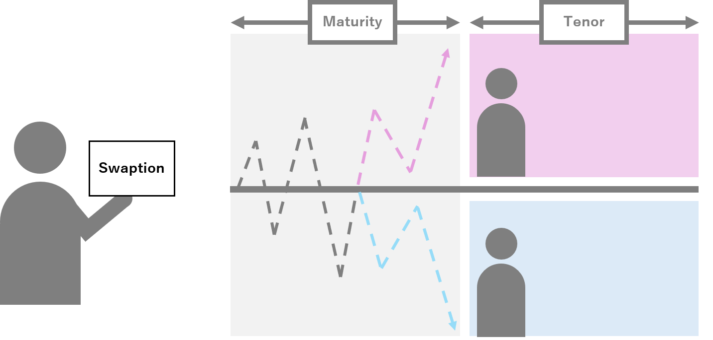
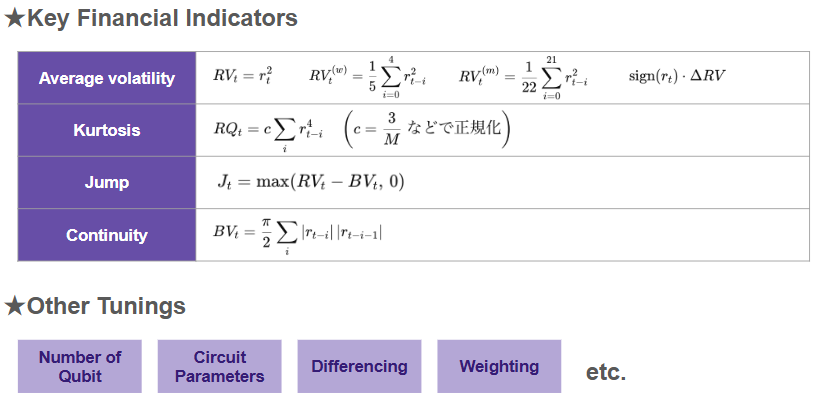
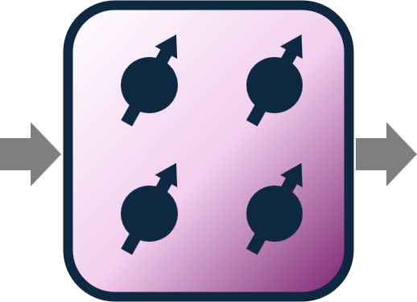
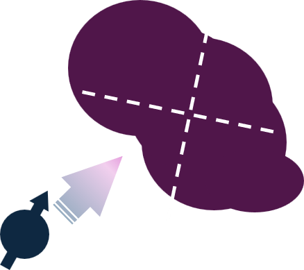

# Q-bitcoin 🪙  
### Predicting Interest Rates with Quantum Machine Learning (QML)

---

## 🧠 Overview

This project explores the application of **Quantum Machine Learning (QML)** to the **imputation and short-term forecasting** of **interest rate swap options (swaptions)**.  
We use a **synthetic swaption dataset** provided by **IBM**, which represents a realistic grid of **tenors × maturities** over time.  

The objectives are:
1. **Estimate missing values** within the swaption surface.  
2. **Forecast prices** for the following two weeks.  

By leveraging the ability of quantum circuits to **represent and process high-dimensional feature spaces**,  
we implement and compare several QML paradigms — including **Quantum Reservoir Computing (QRC)**, **Variational Quantum Circuits (VQC)**, and **Quantum Kernel Methods (QKM)**.  

This work is part of the **UTokyo Quantum Finance Frontier (QFF) 2025 Challenge**.

---

## 📈 Dataset

The dataset simulates a realistic **swaption price surface**, where each point corresponds to a specific **tenor (contract duration)** and **maturity (time to option expiry)**.  
Missing entries appear due to market data sparsity, and forecasting requires temporal extrapolation across this grid.

  

Swaptions are **options on interest rate swaps** — they give the right, but not the obligation,  
to enter an interest rate swap at a future date.  
Each data point reflects the **premium price** determined by forward-looking market volatility, liquidity, and macroeconomic factors.

  

We also analyze key financial indicators such as **volatility**, **kurtosis**, **jump intensity**, and **continuity**,  
as well as model-level tunings including **number of qubits**, **circuit depth**, **normalization**, and **weighting schemes**.

---

## ⚛️ Quantum Approach

Quantum computing allows us to map structured financial data into **Hilbert space representations**,  
where **amplitudes** and **phases** encode complex correlations that may be inaccessible to classical models.

The general framework of our QML models can be expressed as:

$$
|\psi(t + \Delta t)\rangle = U(\boldsymbol{\theta}, t) \, |\psi(t)\rangle
$$

where  
- $$|\psi(t)\rangle$$ represents the quantum state encoding current financial features,  
- $$U(\boldsymbol{\theta}, t)$$ is a parametrized quantum evolution (unitary), and  
- the measurement outcomes are mapped back to forecasted prices.

This unified formalism encompasses all three methods described below.

---

## 🧮 Methods

### 1. Quantum Reservoir Computing (QRC)

  

QRC uses a fixed quantum system as a **nonlinear dynamical reservoir**.  
Only the output layer is trained, while the quantum dynamics generate a rich temporal representation of the input signal.  
It captures complex time correlations without the need for deep optimization.

---

### 2. Variational Quantum Circuit (VQC)

  

VQCs are **parametric quantum models** where trainable parameters $$\boldsymbol{\theta}$$ control  
rotations and entanglement across qubits.  
They are optimized via hybrid classical–quantum feedback to minimize forecasting loss.  
VQCs enable flexible model architectures tailored to financial dynamics.

---

### 3. Quantum Kernel Method (QKM)

  

QKMs embed classical inputs into quantum states  
and measure pairwise similarities in Hilbert space.  
These quantum kernels replace classical RBF or polynomial kernels,  
capturing higher-order correlations between time-evolving swaption features.

---

## 🧩 Pipeline Summary

  

1. **Data Preprocessing & Normalization**  
   - Handle missing data, scaling, and differencing.  
2. **Quantum Feature Encoding**  
   - Angle or amplitude encoding schemes for each data point.  
3. **Model Training**  
   - QRC / VQC / QKM-based regression or forecasting models.  
4. **Evaluation & Visualization**  
   - Compare error metrics (RMSE, MAE), visualize surfaces and temporal trends.

---

## 🧮 Environment

